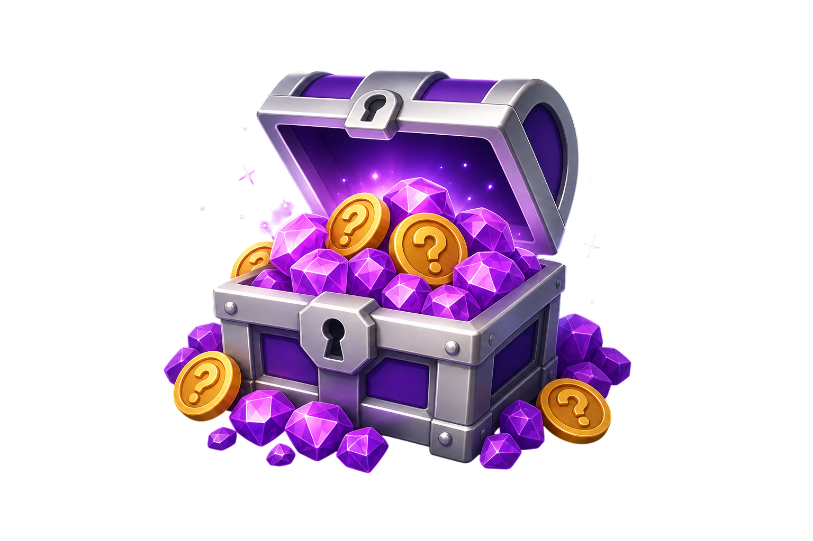

# Brain Dash Quiz

A browser-based multiple-choice trivia quiz game with a "Cosmic Ember" dark-themed design. Built with pure HTML, CSS, and JavaScript — no frameworks, no build tools, no backend.



---

## Table of Contents

- [Features](#features)
- [Demo](#demo)
- [Setup & Installation](#setup--installation)
- [How to Play](#how-to-play)
- [Game Screens](#game-screens)
- [Scoring System](#scoring-system)
- [Difficulty Levels](#difficulty-levels)
- [Categories](#categories)
- [Technical Architecture](#technical-architecture)
- [Project Structure](#project-structure)
- [Deployment](#deployment)
- [Accessibility](#accessibility)
- [Technologies](#technologies)

---

## Features

- Trivia questions from the [Open Trivia Database](https://opentdb.com/) API
- 3 difficulty levels (Easy, Medium, Hard) with different timers and score multipliers
- 4 curated categories + random mixed mode
- 5-life system with heart UI
- Streak multiplier — earn up to 3× points for consecutive correct answers
- Time bonus — faster answers earn more points
- Offline fallback — 10 built-in questions when the API is unreachable
- Synthesized sound effects via Web Audio API (no audio files needed)
- Persistent best score saved in `localStorage`
- Fully responsive design — mobile (320px) through ultrawide (1920px+)
- Glass-morphism dark theme with animated backgrounds
- Accessibility support — reduced motion, high contrast, ARIA attributes
- Deployment-ready for Vercel and Netlify

---

## Demo

Open `index.html` in any modern browser. An internet connection is recommended for live trivia questions, but the game works offline with 10 built-in fallback questions.

---

## Setup & Installation

### Requirements

- A modern web browser (ES6+ support)
- (Optional) XAMPP, Vercel, or Netlify for hosting
- (Optional) Internet connection for live API questions

### Quick Start

1. **Clone or download** this repository.

2. **Open the game:**
   - **Direct:** Double-click `index.html` to open in your browser.
   - **XAMPP:** Place the project in `C:\xampp\htdocs\WebSimpleGame`, start Apache, and visit `http://localhost/WebSimpleGame/`.
   - **Any static server:** Serve the folder with any HTTP server (e.g., `npx serve .`).

3. **Play!** No build step, no dependencies to install.

---

## How to Play

### Controls

- **Click / Tap** on answer buttons to select your answer.
- **Click / Tap** on menu buttons, category buttons, and difficulty selectors to navigate.
- The game is fully touch-compatible with `touch-action: manipulation` to prevent double-tap zoom on mobile.

### Objective

Answer 10 trivia questions correctly while managing your 5 lives. Earn the highest score possible!

### Rules

1. Each round has **10 questions**.
2. You start with **5 lives** (displayed as hearts).
3. Each question has a **countdown timer** — answer before time runs out!
4. **Correct answer:** Earn points based on speed, streak, and difficulty.
5. **Wrong answer or timeout:** Lose 1 life, streak resets to 0.
6. **Game ends** when you answer all 10 questions (win) or lose all lives (lose).
7. Your **best score** is saved across sessions.

---

## Game Screens

### 1. Landing Screen (Menu)

The main menu displays the game title, a hero treasure chest image, and your all-time best score. Click **"Start playing"** to begin.

### 2. Browse / Options Screen

Configure your game before starting:

- **Difficulty:** Choose Easy, Medium, or Hard
- **Category:** Select from 4 categories or "Play Mixed" for random questions
- **Sound:** Toggle sound effects on or off

### 3. Quiz Screen

The active gameplay screen showing:

| Element | Description |
|---|---|
| **HUD** | Question number (Q 1/10), current score, lives (hearts) |
| **Timer Bar** | Visual countdown that changes color (purple → amber → red) |
| **Tags** | Current category and difficulty |
| **Question** | The trivia question text |
| **Answers** | 4 multiple-choice buttons in a 2-column grid |

### 4. Game Over Screen

Displays your final score, best score, and a win/lose message. Choose **"Play Again"** (same category) or **"Main Menu"**.

---

## Scoring System

Points per correct answer are calculated as:

```
score = (base_points + time_bonus) × streak_multiplier × difficulty_multiplier
```

| Component | Description |
|---|---|
| **Base Points** | 100 points per correct answer |
| **Time Bonus** | Up to 50 extra points (proportional to remaining time) |
| **Streak Multiplier** | 1× + consecutive correct answers (capped at 3×) |
| **Difficulty Multiplier** | Easy: 1×, Medium: 1.25×, Hard: 1.5× |

**Example:** On Hard difficulty, with 3 consecutive correct answers and fast response:
`(100 + 45) × 3 × 1.5 = 652 points`

---

## Difficulty Levels

| Difficulty | Timer | Score Multiplier | Description |
|---|---|---|---|
| **Easy** | 20 seconds | 1.0× | Relaxed pace, standard scoring |
| **Medium** | 15 seconds | 1.25× | Moderate challenge, bonus points |
| **Hard** | 12 seconds | 1.5× | Fast-paced, maximum points |

---

## Categories

| Category | Source |
|---|---|
| General Knowledge | OpenTDB (ID: 9) |
| Science & Nature | OpenTDB (ID: 17) |
| Computers | OpenTDB (ID: 18) |
| History | OpenTDB (ID: 22) |
| **Play Mixed** | Random questions from all categories |

---

## Technical Architecture

### Architecture Pattern

**Module-per-concern with a central controller.** Each JS file defines a global object literal (singleton pattern). Scripts are loaded in dependency order:

```
storage.js → api.js → ui.js → quiz.js → app.js
```

### Data Flow

```
┌──────────────┐     ┌──────────────┐     ┌──────────────┐
│   app.js     │────▶│   quiz.js    │────▶│   api.js     │
│ (Controller) │     │ (Game Logic) │     │ (Data Layer) │
└──────┬───────┘     └──────────────┘     └──────────────┘
       │
       ▼
┌──────────────┐     ┌──────────────┐
│    ui.js     │     │ storage.js   │
│ (Rendering)  │     │ (Persistence)│
└──────────────┘     └──────────────┘
```

1. **`app.js`** orchestrates screen transitions, binds UI events, and coordinates all modules.
2. **`quiz.js`** manages game state (score, lives, streak, timer) and calculates points.
3. **`api.js`** fetches questions from OpenTDB, manages session tokens, and handles offline fallback.
4. **`ui.js`** renders questions, updates the HUD, and manages screen visibility.
5. **`storage.js`** wraps `localStorage` for persisting best score, sound preference, and difficulty.

### Sound System

Sound effects are synthesized in real-time using the Web Audio API — no audio files required:

- **Correct answer:** 880Hz sine wave (0.08 seconds)
- **Wrong answer:** 220Hz sine wave (0.12 seconds)

---

## Project Structure

```
WebSimpleGame/
├── index.html                    # Single-page app entry point
├── README.md                     # This file
├── DEPLOY.md                     # Deployment instructions
├── netlify.toml                  # Netlify deployment config
├── vercel.json                   # Vercel deployment config
├── assets/
│   ├── hero-chest.png            # Landing page hero image
│   ├── hero-chest3.png           # Alternate hero image
│   └── quiz-bg.png               # Background image during gameplay
├── css/
│   └── style.css                 # All styles — "Cosmic Ember" design system
├── data/
│   └── fallback.json             # 10 offline fallback trivia questions
└── js/
    ├── storage.js                # localStorage wrapper + difficulty config
    ├── api.js                    # OpenTDB API client + offline fallback
    ├── ui.js                     # DOM manipulation / rendering layer
    ├── quiz.js                   # Game state machine / logic engine
    └── app.js                    # Application controller / orchestrator
```

---

## Deployment

### XAMPP (Local)

1. Copy the project to `C:\xampp\htdocs\WebSimpleGame`.
2. Start Apache in XAMPP Control Panel.
3. Open `http://localhost/WebSimpleGame/` in your browser.

### Vercel

```bash
npm i -g vercel
vercel
```

Or connect your GitHub repository in the [Vercel dashboard](https://vercel.com/dashboard). No build command needed — publish directory is `.`.

### Netlify

Drag and drop the project folder at [app.netlify.com/drop](https://app.netlify.com/drop), or connect your repository with publish directory `.` and an empty build command.

### Any Static Host

Since this is a zero-dependency static site, you can host it on any static file server — GitHub Pages, Cloudflare Pages, AWS S3, etc.

---

## Accessibility

- `aria-label` attributes on all screen sections
- `role="group"` on the answer grid
- `aria-live="polite"` on feedback messages
- `prefers-reduced-motion` media query disables all animations
- `prefers-contrast: high` media query increases border widths and text opacity
- Semantic HTML with proper heading hierarchy

---

## Technologies

| Technology | Usage |
|---|---|
| **HTML5** | Semantic markup, single-page structure |
| **CSS3** | Custom properties, clamp(), glass-morphism, animations, responsive design |
| **JavaScript (ES6+)** | Game logic, DOM manipulation, Web Audio API, Fetch API |
| **Open Trivia Database** | Free trivia question API |
| **localStorage** | Client-side persistence |
| **Google Fonts** | Nunito + Outfit typefaces |

---

## License

This project is for educational and portfolio purposes.
